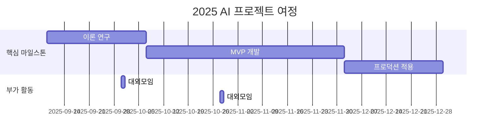

<h1 align="center"> 🪏 Query VendingMachine(쿼리 자판기) </h1>

<div align="center">
<a href="https://pseudo-lab.com"></a>
<a href="https://discord.gg/EPurkHVtp2"></a>
<a href="https://github.com/Pseudo-Lab/10th-template/stargazers"></a>
<a href="https://github.com/Pseudo-Lab/10th-template/network/members"></a>
<a href="https://github.com/Pseudo-Lab/10th-template/pulls"></a>
<a href="https://github.com/Pseudo-Lab/10th-template/issues"></a>
<a href="https://github.com/Pseudo-Lab/10th-template/graphs/contributors"></a>
<a href="https://hits.seeyoufarm.com"></a>
</div>
<br>

<!-- sheilds: https://shields.io/ -->
<!-- hits badge: https://hits.seeyoufarm.com/ -->

> Welcome to Text2SQL Study repository! We aim to explore natural language interfaces to databases, offering tools and frameworks for SQL learning, prompt engineering, and query evaluation. Join us in advancing the field of Text2SQL through open collaboration and innovation!

🚀 Query VendingMachine — 가짜연구소 Text2Sql 프로젝트


## 🌟 프로젝트 목표 (Project Vision)
"구현부터 실험까지 함께 공부하는 Text2Sql 스터디"
- 오픈소스 프로젝트 — Text2Sql 스터디 및 구현 프로젝트
- 개인 성장과 집단 지혜의 시너지 창출
- 오픈소스 정신을 바탕으로 한 지식 공유 문화
- 실패를 성공의 디딤돌로 만드는 실험적 접근
- [프로젝트 계획 노션 페이지](https://www.notion.so/chanrankim/Text2Sql-255963ffa3ee80a688b7c082b905e551?d=1ba963ffa3ee83db9e6f83f9a30be927)

## 🧑 역동적인 팀 소개 (Dynamic Team)

| 역할          | 이름 |  기술 스택 배지                                                                 | 주요 관심 분야                          |
|---------------|------|-----------------------------------------------------------------------|----------------------------------------|
| **Project Manager** | 이청록 |   | AI/추천 서비스 엔지니어링            |
| **Member** | 멤버1 |   | 관심분야1                  |


## 🚀 프로젝트 로드맵 (Project Roadmap)



## 🛠️ 우리의 개발 문화 (Our Development Culture)
**우리의 개발 문화**  
```python
class CollaborationFramework:
    def __init__(self):
        self.tools = {
            'communication': 'Discord',
            'version_control': 'GitHub Projects',
            'ci/cd': 'GitHub Actions',
            'docs': 'Github Wiki'
        }
    
    def workflow(self):
        return """주간 사이클:
        1️⃣ 화요일: 리뷰 및 공유"""
```


## 📈 성과 지표 (Achievement Metrics)
**2024 주요 KPI**  
| 지표                     | 목표치 | 현재 달성률 |
|--------------------------|--------|-------------|
| 커밋 수                    | 500  | 0%         |
| 쿼리 정확도                 | 90%    | 0%         | 


## 💻 주차별 활동 (Activity History)

| 날짜 | 내용 | 결과물 | 
| -------- | -------- | ---- |
| 2025/09/09 |  1주차      |  미정    |
| 2025/09/16 |  2주차 | 미정 | 
| 2025/09/23 |  매지컬 위크 | 미정 | 
| 2025/09/30 |  3주차 | 미정 | 
| 2025/10/07 |  4주차 | 미정 | 
| 2025/10/14 |  5주차 | 미정 | 
| 2025/10/21 |  6주차 | 미정 | 
| 2025/10/28 |  7주차 | 미정 | 
| 2025/11/04 |  8주차 | 미정 | 
| 2025/11/11 |  9주차 | 미정 | 
| 2025/11/18 |  10주차 | 미정 | 
| 2025/11/25 |  11주차 | 미정 | 
| 2025/12/02 |  12주차 | 미정 | 
| 2025/12/09 |  13주차 | 미정 | 
| 2025/12/16 |  14주차 | 미정 | 
| 2025/12/23 |  15주차 | 미정 | 
| 2025/12/30 |  16주차 | 미정 | 


## 💡 학습 자원 (Learning Resources)
**우리가 만든 지식 허브**  
- github wiki


## 🌱 참여 안내 (How to Engage)
- 빌더로 참여 — 프로젝트 기획·운영·개발 주도
- 러너로 참여 — 연구·개발 등 실행
- 청강 참여 — 공개 세션 참여 가능

❗️참여 링크: [가짜연구소 디스코드](https://discord.gg/EPurkHVtp2)
❗️커뮤니케이션 채널: 디스코드 #{{채널명}}

**누구나 청강을 통해 모임을 참여하실 수 있습니다.**  
1. 특별한 신청 없이 정기 모임 시간에 맞추어 디스코드 #Room-GH 채널로 입장
2. Magical Week 중 행사에 참가
3. Pseudo Lab 행사에서 만나기

## Acknowledgement 🙏

이 프로젝트는 가짜연구소 Open Academy로 진행됩니다.
여러분의 참여와 기여가 ‘우연한 혁명(Serendipity Revolution)’을 가능하게 합니다. 모두에게 깊은 감사를 전합니다.
OOO is developed as part of Pseudo-Lab's Open Research Initiative. Special thanks to our contributors and the open source community for their valuable insights and contributions.

## About Pseudo Lab 👋🏼</h2>

[Pseudo-Lab](https://pseudo-lab.com/) is a non-profit organization focused on advancing machine learning and AI technologies. Our core values of Sharing, Motivation, and Collaborative Joy drive us to create impactful open-source projects. With over 5k+ researchers, we are committed to advancing machine learning and AI technologies.

<h2>Contributors 😃</h2>
<a href="https://github.com/Pseudo-Lab/10th-template/graphs/contributors">
  
</a>
<br><br>

<h2>License 🗞</h2>

This project is licensed under the [MIT License](https://opensource.org/licenses/MIT).

🚩 추가 팁 (Usage Tips)
- 각 항목 내 {{ }} 표시된 부분을 프로젝트에 맞게 꼭 수정하세요.
- 불필요한 프로젝트 유형 예시는 제거하거나 교체해 명확하게 하세요.
- 로드맵과 활동내역 부분에 Mermaid 다이어그램 등을 이용해 시각적으로 표현하는 것을 추천합니다.
- 체크박스(✅)와 표를 적절히 활용하면 진행 상황 한눈에 파악이 쉽습니다.
- ‘빌더’와 ‘러너’의 역할 분담과 상호 피드백 문화 강화에 README 내 문장으로 강조를 절대 잊지 마세요.
- README가 단순 안내서 이상으로 공동체 철학과 가치를 담는 협업 선언문임을 인지하고, 누구나 읽고 이해하기 쉽도록 간결 명료하게 작성하세요.
